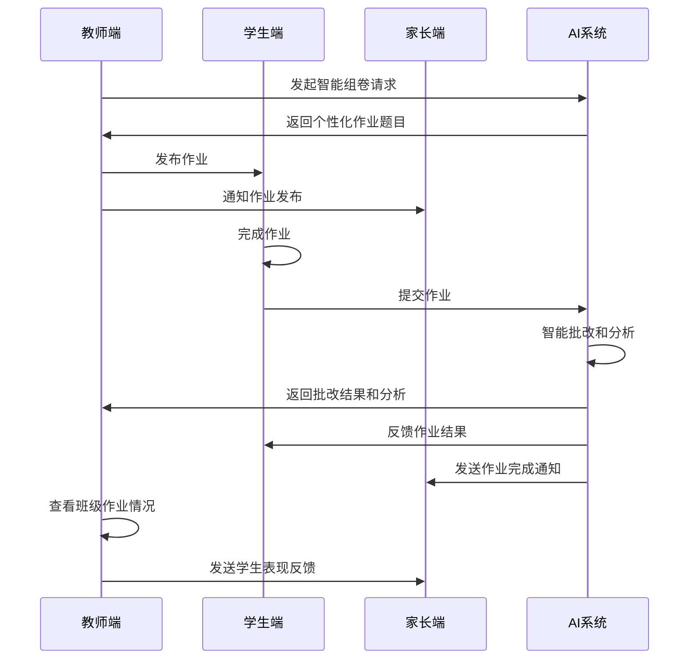
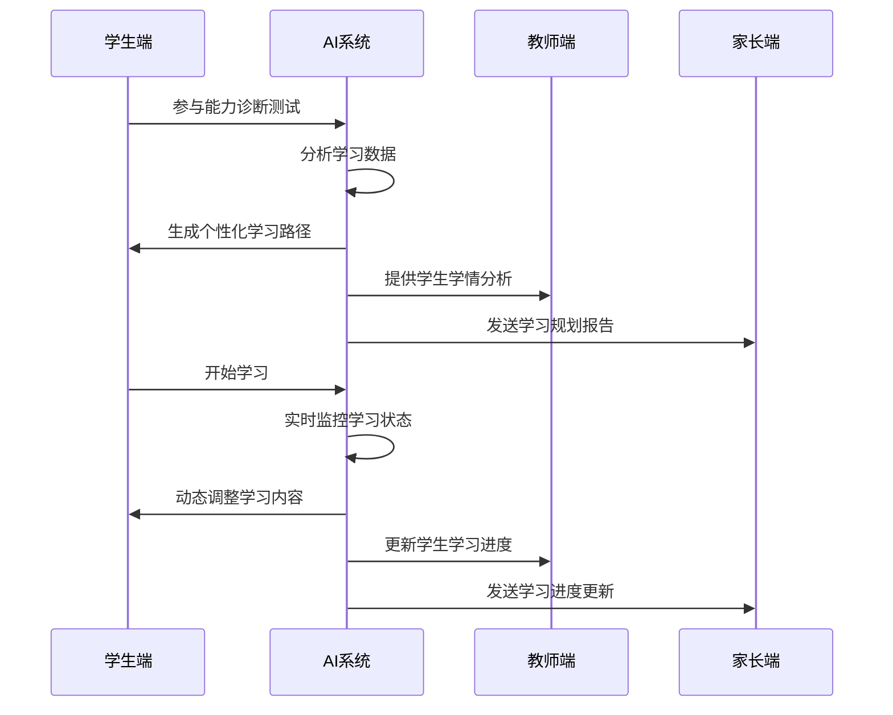
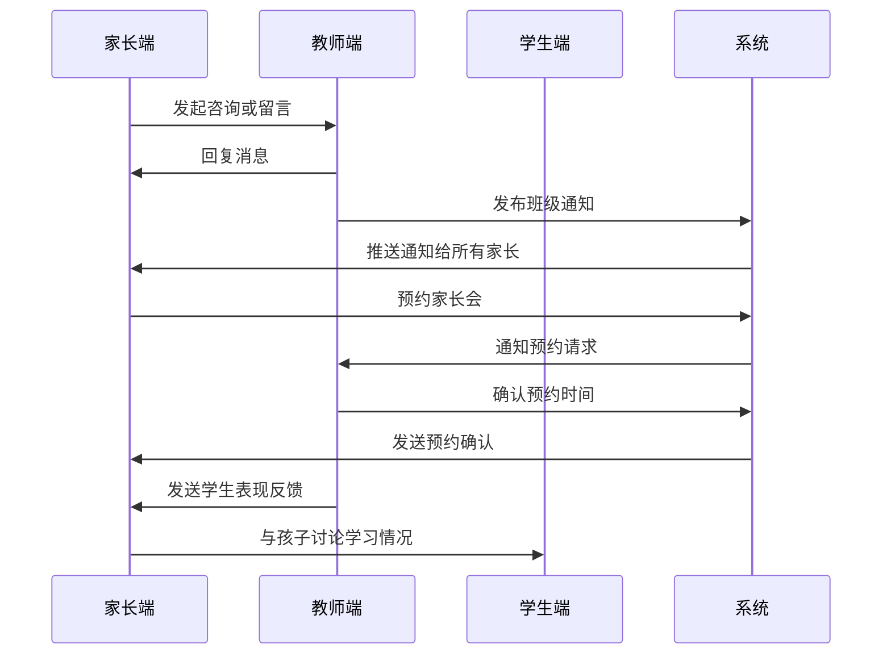

# 教育平台三角色功能架构设计

## 目录
1. [项目概述](#项目概述)
2. [需求分析](#需求分析)
3. [教师端功能设计](#教师端功能设计)
4. [学生端功能设计](#学生端功能设计)
5. [家长端功能设计](#家长端功能设计)
6. [用户故事](#用户故事)
7. [交互流程设计](#交互流程设计)
8. [系统架构](#系统架构)
9. [数据流转机制](#数据流转机制)
10. [技术方案](#技术方案)

## 1. 项目概述

### 1.1 项目背景
基于当前教育数字化转型的趋势，设计一个集成AI技术的智慧教育平台，实现教师、学生、家长三端协同的教育生态系统。平台旨在通过人工智能技术提升教学效率，实现个性化学习，加强家校沟通。

### 1.2 设计目标
- **教师端**：减负增效，因材施教[1]
- **学生端**：自主学习，全面发展[1]  
- **家长端**：家校共育，快乐成长[1]

### 1.3 核心价值
- 提升教学质量和效率
- 实现个性化学习路径
- 加强家校协作沟通
- 基于AI的智能化教育服务

## 2. 需求分析

### 2.1 教师痛点分析
- 备课工作量大，缺乏优质教学资源
- 作业批改耗时，无法及时掌握学生学情
- 缺乏精准的学情分析工具
- 家校沟通效率低下

### 2.2 学生痛点分析  
- 学习内容缺乏个性化
- 缺乏有效的学习指导和答疑
- 学习进度难以跟踪
- 学习兴趣不高，缺乏互动

### 2.3 家长痛点分析
- 无法及时了解孩子在校情况
- 缺乏科学的家庭教育指导
- 与老师沟通渠道有限
- 难以辅导孩子学习

## 3. 教师端功能设计

### 3.1 功能架构图

```
教师端
├── 课程规划模块
│   ├── 智能备课系统
│   ├── 教学资源库
│   ├── 课程计划管理
│   └── 教学进度跟踪
├── 作业设计模块  
│   ├── 智能组卷系统
│   ├── 作业布置管理
│   ├── 自动批改功能
│   └── 作业效果分析
├── 学情分析模块
│   ├── 学生画像分析
│   ├── 学习行为追踪
│   ├── 成绩统计分析
│   └── 预警提醒系统
├── AI辅助教学工具
│   ├── AI课堂助手
│   ├── 智能答疑系统
│   ├── 个性化推荐
│   └── 教学质量评估
└── 家校沟通模块
    ├── 班级通知发布
    ├── 家长会议管理  
    ├── 学生表现反馈
    └── 家校互动记录
```

### 3.2 核心功能详述

#### 3.2.1 智能备课系统
**功能描述**：基于AI技术的备课辅助工具[2]
- **知识图谱构建**：自动构建学科知识图谱，理清知识点关联
- **教案智能生成**：根据教学目标自动生成教案模板
- **资源智能推荐**：基于教学内容推荐相关的教学素材
- **教学设计优化**：AI分析教学设计合理性并提供优化建议

#### 3.2.2 智能组卷系统
**功能描述**：基于题库和学情数据的智能出题系统
- **题目难度匹配**：根据学生能力水平匹配合适难度的题目
- **知识点覆盖分析**：确保作业覆盖重要知识点
- **时间预估功能**：预估作业完成时间，避免过重负担
- **个性化作业**：为不同层次学生生成差异化作业

#### 3.2.3 学情分析仪表板
**功能描述**：多维度学情数据可视化分析工具
- **实时学情监控**：实时展示班级整体学习状态
- **个体差异分析**：识别学生个体学习特点和问题
- **学习轨迹追踪**：记录学生学习路径和进步情况
- **预测性分析**：预测学生学习风险和发展趋势

#### 3.2.4 AI课堂助手
**功能描述**：课堂教学智能辅助工具[2]
- **课堂互动管理**：智能管理课堂提问和讨论
- **注意力检测**：通过视觉AI检测学生听课状态
- **实时反馈收集**：收集学生对课堂内容的理解情况
- **教学节奏调整**：根据学生反馈调整教学进度

### 3.3 用户体验设计

#### 3.3.1 界面设计原则
- **简洁高效**：界面简洁，操作流程简化
- **数据可视化**：重要数据以图表形式展示
- **移动优先**：支持手机端操作核心功能
- **个性化定制**：支持界面布局个性化设置

#### 3.3.2 操作流程优化
- **一键操作**：常用功能一键完成
- **批量处理**：支持批量批改、批量通知等
- **智能提醒**：重要事项智能提醒
- **历史记录**：保存操作历史，便于查看和复用

## 4. 学生端功能设计

### 4.1 功能架构图

```
学生端
├── 个性化学习模块
│   ├── 学习路径规划
│   ├── 自适应学习系统
│   ├── 知识掌握评估
│   └── 学习内容推荐
├── AI学习助手模块
│   ├── 智能答疑系统
│   ├── 学习伙伴陪伴
│   ├── 口语练习助手
│   └── 作文批改指导
├── 作业提交模块
│   ├── 作业接收查看
│   ├── 在线作业完成
│   ├── 作业提交管理
│   └── 错题本生成
├── 学习进度追踪模块
│   ├── 学习数据统计
│   ├── 进度可视化展示
│   ├── 成就系统管理
│   └── 学习报告生成
└── 互动学习模块
    ├── 同伴协作学习
    ├── 课堂互动参与
    ├── 学习小组管理
    └── 竞技学习游戏
```

### 4.2 核心功能详述

#### 4.2.1 自适应学习系统
**功能描述**：基于学生学习数据的个性化学习路径规划[1]
- **能力诊断**：通过智能测评诊断学生知识掌握情况
- **路径生成**：根据诊断结果生成个性化学习路径
- **难度调节**：根据学习表现动态调整内容难度
- **进度控制**：智能控制学习进度，确保知识掌握扎实

#### 4.2.2 AI智能答疑
**功能描述**：24小时在线的AI学习助手[2]
- **多模态交互**：支持文字、语音、图片等多种提问方式
- **引导式解答**：不直接给答案，而是引导学生思考
- **知识关联**：答疑时关联相关知识点，举一反三
- **学习记录**：记录答疑历史，形成个人学习档案

#### 4.2.3 智能错题本
**功能描述**：基于AI技术的错题管理和复习系统[2]
- **错题自动识别**：AI自动识别和采集学生错题
- **错因分析**：分析错题原因，分类整理
- **相似题推荐**：推荐相似题目进行巩固练习
- **复习提醒**：根据遗忘曲线智能提醒复习时间

#### 4.2.4 学习游戏化
**功能描述**：通过游戏化机制提升学习兴趣
- **积分系统**：学习行为获得积分奖励
- **等级成长**：根据学习进度提升等级
- **徽章成就**：设置各类学习成就徽章
- **排行榜**：班级或年级学习排行榜

### 4.3 学习体验优化

#### 4.3.1 个性化界面
- **主题定制**：支持多种界面主题选择
- **功能组合**：学生可自定义常用功能布局
- **学习模式**：专注模式、娱乐模式等不同学习模式

#### 4.3.2 社交学习功能
- **学习小组**：组建学习小组，协作完成项目
- **同伴互助**：同学间相互答疑和讨论
- **学习分享**：分享学习心得和成果

## 5. 家长端功能设计

### 5.1 功能架构图

```
家长端
├── 学习监督模块
│   ├── 学习时间监控
│   ├── 作业完成情况
│   ├── 学习质量评估
│   └── 学习习惯分析
├── 家校沟通模块
│   ├── 老师消息接收
│   ├── 在线家长会
│   ├── 预约面谈系统
│   └── 班级群组交流
├── 学情报告模块
│   ├── 学习报告查看
│   ├── 成绩变化趋势
│   ├── 能力发展评估
│   └── 同级对比分析
├── 教育资源推荐模块
│   ├── 家庭教育指导
│   ├── 学习资源推荐
│   ├── 兴趣班推荐
│   └── 教育政策解读
└── 家庭辅导模块
    ├── 辅导内容指导
    ├── 亲子活动推荐
    ├── 学习环境优化
    └── 心理健康关注
```

### 5.2 核心功能详述

#### 5.2.1 智能学情报告
**功能描述**：基于学生学习数据生成的综合学情分析报告[1]
- **学习状况概览**：整体学习状况的可视化展示
- **学科能力分析**：各学科能力发展水平分析
- **学习习惯评估**：学习时间、专注度等习惯分析
- **发展建议**：基于数据分析的个性化发展建议

#### 5.2.2 家校实时沟通
**功能描述**：多渠道的家校沟通平台
- **消息通知**：接收学校和老师的各类通知
- **在线咨询**：与老师进行一对一在线咨询
- **群组交流**：参与班级家长群讨论
- **预约系统**：在线预约家长会或面谈时间

#### 5.2.3 家庭教育指导
**功能描述**：专业的家庭教育指导和建议
- **教育方法推荐**：根据孩子特点推荐教育方法
- **亲子活动建议**：推荐适合的亲子互动活动
- **心理健康关注**：关注孩子心理健康状况
- **专家咨询**：提供教育专家在线咨询服务

#### 5.2.4 学习环境优化
**功能描述**：帮助家长营造良好的家庭学习环境
- **学习空间设计**：学习空间布置建议
- **时间管理指导**：帮助制定合理的学习时间安排
- **设备使用管理**：电子设备使用时间和内容管理
- **家庭规则制定**：协助制定家庭学习规则

### 5.3 家长体验优化

#### 5.3.1 信息获取便利化
- **消息分类**：不同类型消息分类展示
- **重要提醒**：重要信息特别标注和提醒
- **历史记录**：完整的沟通和学习记录

#### 5.3.2 操作简化
- **一键操作**：常用功能一键完成
- **语音交互**：支持语音消息和语音查询
- **快速反馈**：快速回复老师消息

## 6. 用户故事

### 6.1 教师端用户故事

#### 6.1.1 智能备课场景
**用户故事**：作为一名语文老师，我希望系统能根据教学大纲和学生水平，自动为我生成详细的教案和相关教学素材，这样我就能节省备课时间，专注于教学方法的创新。

**验收标准**：
- 输入教学目标后，系统在3分钟内生成完整教案
- 教案包含教学目标、重难点、教学步骤、教学方法等
- 自动匹配相关的教学视频、课件、练习题等资源
- 支持教案个性化修改和保存

#### 6.1.2 智能批改场景
**用户故事**：作为一名数学老师，我希望系统能自动批改客观题作业，并对主观题提供批改建议，这样我就能快速了解学生掌握情况，把更多时间用于针对性教学。

**验收标准**：
- 客观题自动批改准确率达到99%以上
- 主观题提供详细的评分建议和改进意见
- 生成班级和个人的错题统计分析
- 标记需要重点关注的学生和知识点

#### 6.1.3 学情分析场景
**用户故事**：作为一名班主任，我希望能通过数据看到每个学生的学习状态和发展趋势，及时发现学习困难的学生，以便进行针对性辅导。

**验收标准**：
- 提供班级整体和个人的学习数据分析
- 以图表形式直观展示学习趋势
- 自动标识需要关注的学生
- 提供个性化的教学建议

### 6.2 学生端用户故事

#### 6.2.1 个性化学习场景
**用户故事**：作为一名初中生，我希望系统能根据我的学习水平和进度，为我推荐合适的学习内容和练习题，让我能更高效地学习。

**验收标准**：
- 根据学习诊断结果生成个性化学习路径
- 推荐内容难度适中，既有挑战性又不会过难
- 学习进度可视化，能看到自己的成长
- 支持学习计划的动态调整

#### 6.2.2 AI答疑场景
**用户故事**：作为一名学生，我希望在遇到不懂的问题时，有AI助手能及时为我答疑解惑，并引导我思考，而不是直接给我答案。

**验收标准**：
- 支持文字、语音、图片等多种提问方式
- AI回答准确率达到90%以上
- 采用引导式回答，培养学生思维能力
- 记录答疑历史，便于复习

#### 6.2.3 学习进度追踪场景
**用户故事**：作为一名学生，我希望能清楚地看到自己的学习进度和成果，了解自己在哪些方面还需要提高。

**验收标准**：
- 提供详细的学习数据统计
- 以图表形式展示学习进度和成绩变化
- 显示各科目的掌握程度
- 提供学习建议和改进方向

### 6.3 家长端用户故事

#### 6.3.1 学情监督场景
**用户故事**：作为一名家长，我希望能及时了解孩子的学习情况，包括作业完成情况、学习时间、学习效果等，以便更好地指导孩子学习。

**验收标准**：
- 实时显示孩子的作业完成状态
- 提供学习时间和质量分析
- 显示各科目的学习表现
- 当孩子出现学习问题时及时提醒

#### 6.3.2 家校沟通场景
**用户故事**：作为一名家长，我希望能方便地与老师沟通交流，了解孩子在学校的表现，共同促进孩子的成长。

**验收标准**：
- 能接收老师发送的各类通知和消息
- 支持与老师进行一对一在线交流
- 可以参与班级家长群的讨论
- 能在线预约家长会或面谈时间

#### 6.3.3 教育指导场景
**用户故事**：作为一名家长，我希望能获得专业的家庭教育指导，学习如何更好地教育和陪伴孩子成长。

**验收标准**：
- 根据孩子特点提供个性化教育建议
- 推荐适合的亲子活动和教育方法
- 提供家庭教育相关的学习资源
- 可以咨询教育专家获得专业建议

## 7. 交互流程设计

### 7.1 核心业务流程

#### 7.1.1 作业流程


#### 7.1.2 学习路径规划流程


#### 7.1.3 家校沟通流程


### 7.2 数据流转机制

#### 7.2.1 学习数据流转
```
学生学习行为 → 数据采集 → AI分析处理 → 多维度反馈
    ↓
[学习时长、正确率、完成速度、互动频次]
    ↓
[知识掌握度分析、学习能力评估、学习习惯分析]
    ↓
[学生端：个性化推荐、进度展示]
[教师端：学情分析、教学调整建议]  
[家长端：学习报告、家庭指导建议]
```

#### 7.2.2 教学数据流转
```
教师教学活动 → 数据记录 → 效果分析 → 优化建议
    ↓
[备课时间、教学方法、互动方式、作业设计]
    ↓  
[教学效果评估、学生反馈分析、知识传达效率]
    ↓
[教师端：教学优化建议、资源推荐]
[管理端：教学质量监控、教师发展规划]
```

#### 7.2.3 家校协作数据流转
```
多方协作信息 → 整合分析 → 协同决策 → 共同行动
    ↓
[学校表现、家庭学习、沟通记录、成长数据]
    ↓
[全面成长分析、问题识别、发展规划]
    ↓
[制定共同目标、分工合作、持续跟踪]
```

## 8. 系统架构

### 8.1 整体架构图

```
┌─────────────────────────────────────────────────────────────┐
│                        前端应用层                            │
├──────────────┬──────────────┬──────────────┬─────────────────┤
│   教师端     │    学生端    │   家长端     │    管理端       │
│   Web/App   │   Web/App   │   Web/App   │    Web         │
└──────────────┴──────────────┴──────────────┴─────────────────┘
                              │
┌─────────────────────────────────────────────────────────────┐
│                      API网关层                              │
│        认证授权 │ 路由转发 │ 限流控制 │ 日志记录              │
└─────────────────────────────────────────────────────────────┘
                              │
┌─────────────────────────────────────────────────────────────┐
│                      业务服务层                              │
├──────────┬──────────┬──────────┬──────────┬─────────────────┤
│用户服务  │课程服务  │作业服务  │通信服务  │   AI服务        │
│UserSvc   │CourseSvc │HwSvc     │MsgSvc    │   AISvc         │
└──────────┴──────────┴──────────┴──────────┴─────────────────┘
                              │
┌─────────────────────────────────────────────────────────────┐
│                      数据访问层                              │
├──────────────┬──────────────┬──────────────┬─────────────────┤
│  用户数据    │  教学数据    │  学习数据    │   系统数据      │
│  PostgreSQL  │  PostgreSQL  │  MongoDB     │   Redis         │
└──────────────┴──────────────┴──────────────┴─────────────────┘
                              │
┌─────────────────────────────────────────────────────────────┐
│                      基础设施层                              │
├──────────────┬──────────────┬──────────────┬─────────────────┤
│  容器编排    │  服务发现    │  配置管理    │   监控告警      │
│  Kubernetes  │  Consul      │  Apollo      │   Prometheus    │
└──────────────┴──────────────┴──────────────┴─────────────────┘
```

### 8.2 核心服务模块

#### 8.2.1 用户服务 (UserService)
**职责**：用户身份管理和权限控制
- 用户注册、登录、注销
- 角色权限管理(教师/学生/家长/管理员)
- 用户信息管理和认证
- 单点登录(SSO)支持

#### 8.2.2 课程服务 (CourseService)  
**职责**：课程和教学内容管理
- 课程创建和管理
- 教学资源管理
- 知识图谱构建
- 教学计划制定

#### 8.2.3 作业服务 (HomeworkService)
**职责**：作业全生命周期管理
- 作业布置和发布
- 作业提交和收集
- 智能批改和评分
- 作业统计分析

#### 8.2.4 通信服务 (MessageService)
**职责**：多端消息通信
- 实时消息推送
- 通知公告管理
- 家校沟通记录
- 群组消息管理

#### 8.2.5 AI服务 (AIService)
**职责**：AI能力集成和调用[2]
- 自然语言处理
- 图像识别和OCR
- 智能推荐算法
- 学情分析引擎

### 8.3 数据库设计

#### 8.3.1 用户相关表
```sql
-- 用户基础信息表
CREATE TABLE users (
    id BIGSERIAL PRIMARY KEY,
    username VARCHAR(50) UNIQUE NOT NULL,
    email VARCHAR(100) UNIQUE,
    phone VARCHAR(20),
    password_hash VARCHAR(255) NOT NULL,
    user_type ENUM('teacher', 'student', 'parent', 'admin'),
    status ENUM('active', 'inactive', 'suspended'),
    created_at TIMESTAMP DEFAULT CURRENT_TIMESTAMP,
    updated_at TIMESTAMP DEFAULT CURRENT_TIMESTAMP
);

-- 教师信息表
CREATE TABLE teachers (
    id BIGSERIAL PRIMARY KEY,
    user_id BIGINT REFERENCES users(id),
    teacher_code VARCHAR(20) UNIQUE,
    subject_id INT,
    department VARCHAR(100),
    title VARCHAR(50),
    experience_years INT
);

-- 学生信息表  
CREATE TABLE students (
    id BIGSERIAL PRIMARY KEY,
    user_id BIGINT REFERENCES users(id),
    student_code VARCHAR(20) UNIQUE,
    grade_id INT,
    class_id INT,
    enrollment_date DATE
);

-- 家长信息表
CREATE TABLE parents (
    id BIGSERIAL PRIMARY KEY,
    user_id BIGINT REFERENCES users(id),
    relationship VARCHAR(20)
);

-- 家长学生关联表
CREATE TABLE parent_student_relations (
    id BIGSERIAL PRIMARY KEY,
    parent_id BIGINT REFERENCES parents(id),
    student_id BIGINT REFERENCES students(id),
    relationship_type VARCHAR(20)
);
```

#### 8.3.2 教学相关表
```sql
-- 课程信息表
CREATE TABLE courses (
    id BIGSERIAL PRIMARY KEY,
    course_name VARCHAR(100) NOT NULL,
    course_code VARCHAR(20) UNIQUE,
    subject_id INT,
    grade_level INT,
    description TEXT,
    teacher_id BIGINT REFERENCES teachers(id),
    status ENUM('active', 'inactive'),
    created_at TIMESTAMP DEFAULT CURRENT_TIMESTAMP
);

-- 班级信息表
CREATE TABLE classes (
    id BIGSERIAL PRIMARY KEY,
    class_name VARCHAR(50) NOT NULL,
    grade_id INT,
    teacher_id BIGINT REFERENCES teachers(id),
    academic_year VARCHAR(20),
    student_count INT DEFAULT 0
);

-- 作业信息表
CREATE TABLE assignments (
    id BIGSERIAL PRIMARY KEY,
    title VARCHAR(200) NOT NULL,
    description TEXT,
    course_id BIGINT REFERENCES courses(id),
    teacher_id BIGINT REFERENCES teachers(id),
    class_id BIGINT REFERENCES classes(id),
    assignment_type ENUM('homework', 'quiz', 'exam'),
    total_score INT,
    due_date TIMESTAMP,
    created_at TIMESTAMP DEFAULT CURRENT_TIMESTAMP
);

-- 学生作业提交表
CREATE TABLE assignment_submissions (
    id BIGSERIAL PRIMARY KEY,
    assignment_id BIGINT REFERENCES assignments(id),
    student_id BIGINT REFERENCES students(id),
    content TEXT,
    attachments JSON,
    score INT,
    feedback TEXT,
    status ENUM('pending', 'submitted', 'graded'),
    submitted_at TIMESTAMP,
    graded_at TIMESTAMP
);
```

#### 8.3.3 学习数据表(MongoDB)
```javascript
// 学习行为记录
{
  _id: ObjectId,
  studentId: String,
  courseId: String,
  sessionId: String,
  startTime: Date,
  endTime: Date,
  activities: [
    {
      type: String, // 'read', 'practice', 'quiz', 'video'
      contentId: String,
      duration: Number,
      score: Number,
      correctRate: Number,
      timestamp: Date
    }
  ],
  totalDuration: Number,
  completionRate: Number
}

// 学习分析结果
{
  _id: ObjectId,
  studentId: String,
  courseId: String,
  analysisDate: Date,
  knowledgePoints: [
    {
      pointId: String,
      masteryLevel: Number, // 0-100
      confidence: Number,
      weakness: Boolean,
      recommendedActions: [String]
    }
  ],
  learningStyle: String,
  progressTrend: String,
  predictions: {
    nextWeekPerformance: Number,
    difficultyAreas: [String],
    recommendedFocus: [String]
  }
}
```

## 9. 技术方案

### 9.1 前端技术栈

#### 9.1.1 Web端技术选型
- **框架**：React 18 + TypeScript
- **状态管理**：Redux Toolkit + RTK Query
- **UI组件库**：Ant Design + 自定义组件
- **构建工具**：Vite + ESBuild
- **样式方案**：Styled-components + CSS Modules

#### 9.1.2 移动端技术选型
- **跨平台方案**：React Native + TypeScript
- **状态管理**：Redux Toolkit
- **UI组件库**：React Native Elements
- **导航**：React Navigation 6
- **原生能力**：Expo + 自定义原生模块

#### 9.1.3 实时通信
- **WebSocket**：Socket.io客户端
- **推送通知**：Firebase Cloud Messaging
- **离线缓存**：Service Worker + IndexedDB

### 9.2 后端技术栈

#### 9.2.1 应用服务
- **主框架**：Spring Boot 3.x + Java 17
- **微服务**：Spring Cloud 2023.x
- **API网关**：Spring Cloud Gateway
- **服务注册**：Nacos
- **配置管理**：Nacos Config

#### 9.2.2 数据存储
- **关系数据库**：PostgreSQL 15
- **文档数据库**：MongoDB 6.0
- **缓存**：Redis 7.0 + Redis Cluster
- **搜索引擎**：Elasticsearch 8.x
- **文件存储**：MinIO + CDN

#### 9.2.3 消息队列
- **异步处理**：Apache Kafka
- **实时通信**：Socket.io Server
- **定时任务**：Quartz Scheduler
- **工作流**：Flowable BPMN

### 9.3 AI技术栈

#### 9.3.1 机器学习平台
- **模型框架**：TensorFlow 2.x + PyTorch
- **模型服务**：TensorFlow Serving + TorchServe
- **特征工程**：Apache Spark + MLlib
- **模型管理**：MLflow + Kubeflow

#### 9.3.2 自然语言处理
- **大语言模型**：基于Transformer的自研模型[2]
- **语音识别**：ASR模型集成[2]
- **语音合成**：TTS模型集成
- **文本分析**：spaCy + NLTK

#### 9.3.3 计算机视觉
- **图像识别**：OpenCV + PyTorch Vision
- **OCR识别**：PaddleOCR + Tesseract[2]
- **视频分析**：FFmpeg + MediaPipe
- **人脸识别**：深度学习模型

### 9.4 基础设施

#### 9.4.1 容器化部署
- **容器**：Docker + Docker Compose
- **编排**：Kubernetes 1.28+
- **服务网格**：Istio Service Mesh
- **包管理**：Helm Charts

#### 9.4.2 监控运维
- **监控**：Prometheus + Grafana
- **日志**：ELK Stack (Elasticsearch + Logstash + Kibana)
- **链路追踪**：Jaeger + OpenTelemetry
- **告警**：AlertManager + 钉钉/企微

#### 9.4.3 CI/CD
- **代码管理**：GitLab + Git Flow
- **构建**：GitLab CI/CD + Jenkins
- **制品库**：Harbor Docker Registry
- **部署**：ArgoCD + GitOps

### 9.5 安全方案

#### 9.5.1 身份认证
- **认证协议**：OAuth 2.0 + JWT
- **单点登录**：SAML 2.0 + CAS
- **多因子认证**：TOTP + SMS
- **权限控制**：RBAC + ABAC

#### 9.5.2 数据安全
- **传输加密**：TLS 1.3 + HTTPS
- **存储加密**：AES-256 + RSA
- **敏感数据**：脱敏 + 匿名化
- **备份恢复**：增量备份 + 异地容灾

#### 9.5.3 应用安全
- **API安全**：Rate Limiting + API Key
- **输入验证**：参数校验 + SQL注入防护
- **XSS防护**：CSP + 输出编码
- **CSRF防护**：Token验证 + SameSite

## 10. 总结

本设计方案基于当前教育数字化发展趋势，结合AI技术在教育领域的应用实践[1][2][3]，为教师、学生、家长三个角色设计了完整的功能体系和交互流程。

### 10.1 设计亮点

1. **AI深度集成**：将AI技术融入教学全流程，实现智能备课、自动批改、个性化推荐等功能
2. **三端协同**：建立教师、学生、家长三端协同的教育生态，促进家校共育
3. **个性化学习**：基于学习数据分析，为每个学生提供个性化的学习路径和内容
4. **数据驱动**：通过大数据分析，为教学决策提供科学依据
5. **用户体验优先**：注重用户体验设计，确保各角色都能便捷高效地使用平台

### 10.2 技术特色

1. **微服务架构**：采用微服务架构，确保系统的可扩展性和可维护性
2. **容器化部署**：基于Kubernetes的容器化部署，提高系统的弹性和可靠性
3. **AI能力平台化**：将AI能力封装为统一的服务，便于各业务模块调用
4. **多端技术统一**：采用React技术栈，实现Web和移动端的技术统一

### 10.3 预期效果

1. **提升教学效率**：通过AI辅助工具，减少教师重复性工作，提升教学质量
2. **促进个性化学习**：为学生提供个性化的学习体验，提高学习效果
3. **加强家校沟通**：建立便捷的家校沟通渠道，促进家校协作
4. **推动教育数字化**：为教育数字化转型提供有力支撑

通过这套完整的功能设计和技术方案，能够有效满足现代教育场景中各角色的核心需求，推动教育质量的全面提升。

---

**参考资料**：
1. [科大讯飞智慧教育平台三端功能分析](https://edu.iflytek.com/) - 科大讯飞
2. [有道智慧教育平台AI技术应用](http://zhihui.youdao.com/) - 网易有道  
3. [教育数字化发展政策文件](http://www.moe.gov.cn/fbh/live/2025/56808/) - 教育部
